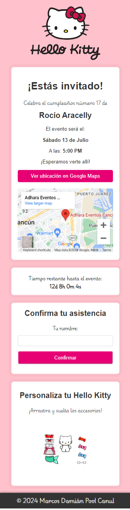

# Party With Hello Kitty

## Descripción

Hello Kitty Fiesta es un proyecto interactivo y creativo diseñado para entusiasmar a los amantes de Hello Kitty con la posibilidad de diseñar sus propias invitaciones de fiesta. Este sistema no solo permite crear invitaciones personalizadas sino que también incorpora elementos lúdicos como la personalización interactiva de Hello Kitty, donde los usuarios pueden vestir a Hello Kitty arrastrando y soltando accesorios en un entorno virtual.

## Características

- **Confirmación por correo:** Envía automáticamente las confirmaciones de asistencia al correo del organizador.
- **Interactico :** Permite personalizar a Hello Kitty arrastrando y soltando accesorios en un entorno interactivo.
- **Integración con Google Maps:** Muestra la ubicación del evento directamente en la invitación.
- **Cuenta Refresiva:** Un contador regresivo muestra cuánto tiempo falta para el evento.
- **Diseño Responsivo:** Asegura que el sitio sea accesible y funcional en todos los dispositivos.
- **Fácil Navegación:** Interfaz intuitiva que guía a los usuarios a través del proceso de creación de invitaciones.

## Capturas de Pantalla

### Interfaz Principal



### Página de Confirmación


## Comenzando

### Instalación

Para desplegar el proyecto en tu entorno local para desarrollo y pruebas, sigue estos pasos:

1. Clona el repositorio:

```bash
git clone https://github.com/marcosd59/hello-kitty-fiesta.git
```

2. Navega al directorio del proyecto:

```bash
cd hello-kitty-fiesta
```

3. Abre `http://localhost:3000` en tu navegador para ver la aplicación.

## Herramientas Utilizadas

- HTML
- CSS
- JavaScript

## Contribuir

Las contribuciones son bienvenidas y ayudan a mejorar y expandir este proyecto. Si deseas contribuir, puedes seguir estos pasos:

1. **Fork** el repositorio.
2. Crea tu **Feature Branch** (`git checkout -b feature/AmazingFeature`).
3. Haz tus **cambios** en el código.
4. **Commit** tus cambios (`git commit -m 'Add some AmazingFeature'`).
5. **Push** a la rama (`git push origin feature/AmazingFeature`).
6. Abre un **Pull Request**.

## Contacto

- **Nombre**: Marcos Damián Pool Canul
- **Correo Electrónico**: <damian.marcospool@gmail.com>
- **GitHub**: [marcosd59](https://github.com/marcosd59)

---

© 2024 Marcos Damián Pool Canul.
